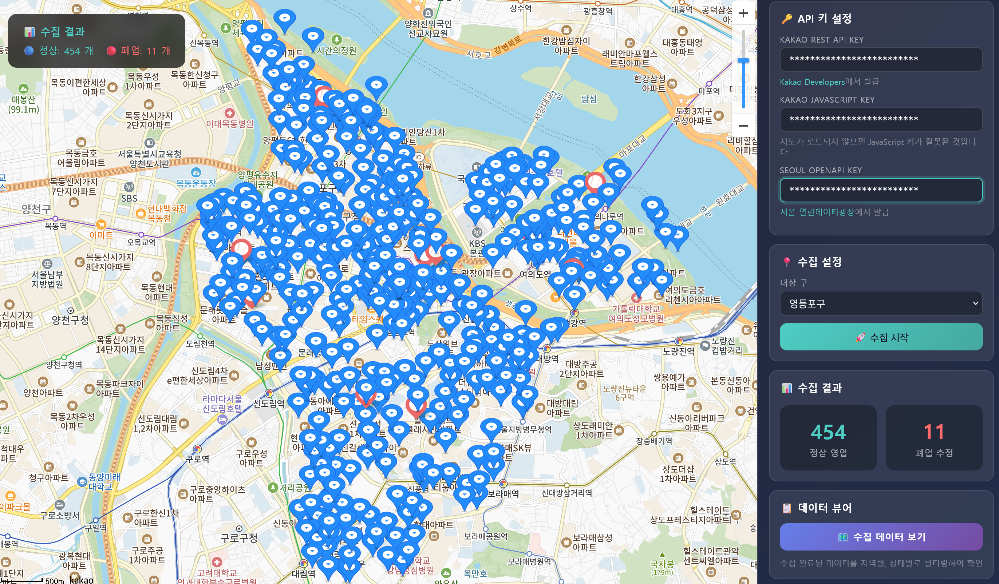

#  Radius Collector: 편의점 폐업 검증 시스템

> **API 한계를 넘어, 신뢰할 수 있는 상권 데이터를 만들어보자**
> 카카오맵 데이터의 정확성을 공공데이터와 교차 검증하여 폐업 매장을 자동 탐지하는 시스템




**프로젝트 기간**: 2025.11 ~ 2026.02

**참여 인원**: 2인 (김동현, 전대원)

---

## 🤔 프로젝트 개요

#### 문제 인식
- 카카오맵에 등록된 편의점들이 **🤔실제로 영업 중인지** 확인할 방법이 없음
- 동네에 폐업한 편의점이 카카오맵에 운영중인걸로 뜸. 네이버지도 동일.

#### 해결 방안
- **다이소를 기준점**으로 1~2km 반경 내 편의점들을 카카오맵 API로 수집
- 3가지 공공데이터(휴게음식점 인허가, 담배소매업 인허가, 소상공인 상권정보)와 **교차 검증**하여 폐업 추정 매장 자동 탐지

**🤔왜 다이소를 기준점으로..?**
- 서울 전역 **균일한 분포** (260+개 지점) → 상권 커버리지 극대화
- 다이소 반경 1~2km에 **편의점 밀집도 높음** → 상권 활성도 proxy로 적합

#### 성과
| 영등포구 항목 | 수치 |
|------|------|
| 카카오맵 편의점 | 463개 |
| 공공데이터 확인 (정상) | 452개 (97.6%) |
| **폐업 추정(영등포구) 및 삭제필요** | **11개 (2.4%)** |

---

## 🧐문제해결과정


### 1. API 45개 제한 — 4분면 분할 검색 

**문제**: 카카오 API는 반경 검색 시 최대 45개(15개×3페이지)만 반환
```
요청: 반경 2km 내 편의점 검색
결과: 45개 (카카오 최대치)
실제: 약 150개 존재 → 105개 누락!

🧐기존: 중심점 기준 반경 r 원형 검색
     ┌─────────────────┐
     │        ●        │  ← 45개만 수집
     │     반경 2km    │
     └─────────────────┘
🧐해결: 다이소 중심점 기준 4분면(1.8km 사각형) 분할 검색
개선: 4개의 1km×1km 사각형으로 분할
     ┌────────┬────────┐
     │   Q2   │   Q1   │  ← 각 45개씩
     │  ●     │     ●  │  = 180개 수집 가능
     ├────────┼────────┤
     │   Q3   │   Q4   │
     │  ●     │     ●  │
     └────────┴────────┘
```

**결과**: 16개 다이소 × 4분면 = 영등포구 전체 463개 편의점 수집 (100% 커버리지)

---

### 2. 신규 매장 누락 — 다이소 공식 API 리버스 엔지니어링 

**문제**: 카카오 API에서 신규 오픈 매장(다이소 신길점) 검색 불가

**해결 과정**:
| 단계 | 작업 | 결과 |
|------|------|------|
| 1 | 다이소몰 매장찾기 페이지 접속 | `daisomall.co.kr/store` |
| 2 | 개발자도구(F12) → Network 탭 | 서버 요청 트리거 모니터링 |
| 3 | 검색 액션 시 트래픽 캡처 | JSON 응답 포함된 요청 식별 |
| 4 | 패킷 분석 | Endpoint, Method, Content-Type 명세 확보 |
| 5 | 필수 헤더/페이로드 식별 | `Referer`, `Origin`, `keyword` 필드 확인 |

```python
# 최종 추출된 API 스펙
url = "https://fapi.daisomall.co.kr/ms/msg/selStr"
headers = {
    "Content-Type": "application/json",
    "Referer": "https://www.daisomall.co.kr/",
    "Origin": "https://www.daisomall.co.kr"
}
payload = {"keyword": "영등포", "pageSize": 100}
# 결과: 신길점 포함 16개 매장 전수 확보
```

---


##  추가 트러블슈팅 요약

| # | 문제 | 원인 | 해결책 |
|---|------|------|--------|
| 3 | 좌표계 불일치 | 서울시(TM) ≠ 카카오(WGS84) | pyproj 좌표 변환 |
| 4 | 전체 레코드 로드 | 응답 속도 저하(3s)-(N+1 쿼리 문제) | 필요 필드만 Select (0.1s) |
| 5 | Race Condition | 동시 수집 충돌 | select_for_update() |
| 6 | 지리적 변수 통제 | 산/강으로 인한 왜곡 | 상위 10개 평균(1.8km) 기준 |
| 7 | Rate Limit 초과 | 연속 호출 | 지수 백오프 재시도 |
| 8 | 데이터 중복 | 4분면 경계 중복 | 좌표 기반 dedupe |
| 9 | 메모리 누수 | 대용량 로드 | iterator + gc |
| 10| 정적 파일 404 | collectstatic 미실행 | whitenoise |
| 11 | CSV 정합성 | 정적 데이터 | OpenAPI 병행 검증 |
| 12 | 중구 다이소 문제 | 구 코드 특수케이스 | gu_codes.py 수정 |

> 상세 기록: [트러블슈팅_기록.md](트러블슈팅_기록.md)

---

## 🫡실행 가이드

### 환경 설정

```bash
# 1. 환경변수 설정 (.env)
KAKAO_API_KEY=your_kakao_rest_api_key
KAKAO_JS_KEY=your_kakao_js_key
SEOUL_OPENAPI_KEY=your_seoul_openapi_key

# 2. Docker 실행
docker compose up -d
docker compose exec web python manage.py migrate
```

#### 웹 UI (수집기) - 메인 페이지


```
http://localhost:8000/
```


#### 수집 데이터 뷰어


```
http://localhost:8000/store-closure/
```

| 기능 | 설명 |
|------|------|
| **전체 통계** | 총 데이터, 정상 영업, 폐업 추정 개수 표시 |
| **상태별 필터** | 정상/폐업 버튼으로 필터링 |
| **지역별 필터** | 구별 데이터 필터링 (동적 생성) |
| **전체 데이터 보기** | 모든 필터 해제 |
| **활성 필터 표시** | 현재 적용된 필터 시각적 표시 |

#### 개발자 모니터링 대시보드


```
http://localhost:8000/dev/monitor/
```

| 섹션 | 표시 내용 |
|------|----------|
| **실시간 모니터링** | 경과 시간, API 호출 수, 수집 데이터 수, 진행률 |
| **5단계 진행 현황** | 각 단계별 상태(대기/실행/완료), 수집 건수, 소요시간, API 호출 수 |
| **4분면 시각화** | 다이소 기준점 + 4분면 검색 영역 지도 표시 |
| **교차 검증 결과** | 정상/폐업 수, 이름/주소/좌표 매칭 수 |
| **수집 성능** | 초당 수집 건수, 예상 완료 시간, API 에러 수 |
| **시스템 리소스** | CPU, 메모리, 디스크, 스레드 수, 네트워크 I/O |
| **실시간 로그** | 단계별 진행 로그 |
| **test_core** | test_core 테스트 실행 버튼 (`/dev/test/`)|


---

## 🤓성능 지표

| 항목 | 수치 | 비고 |
|------|------|------|
| 대량 데이터 생성 | 1,000개 / 0.8초 | Bulk Create 최적화 |
| 공간 쿼리 속도 | 100회 / 0.05초 | PostGIS 인덱스 활용 |
| 전체 파이프라인 | 약 20초 / 1개 구 | 16개 다이소 × 4분면 크롤링 + 검증 |
| API 호출 | 약 200회 / 1개 구 | 4분면 분할 검색 최적화 |
| N+1 쿼리 개선 | 3초 → 0.1초 | 97% 응답 시간 단축 |

---

## 🥸 버전별 개발 히스토리

##### v1.0 — MVP: 데이터 수집기
- 카카오 API로 다이소 주변 상권 데이터 수집
- Rate Limit 준수 (`time.sleep(0.2)`)
- **한계**: API 45개 제한 미인지 (45개 초과해서 수집 불가🔺)

##### v1.1 — 안정성 강화
- `update_or_create()` Upsert 로직 도입
- Docker/Local DB 포트 충돌 해결
- **발견**: API 45개 제한 확인

##### v2.0 — PostGIS 도입
- PostgreSQL + PostGIS, GeoDjango 적용
- 웹 지도 시각화 (`/map/`)
- **한계**: 45개 제한 미해결

##### v2.1 — BigQuery 실험 (실패 → 교훈)
- Google BigQuery + OSM 데이터 시도
- 서울 다이소: (카카오, 네이버)지도 250개 vs OSM지도 60개 (75% 누락)
- **교훈**: "구글의 범용성보다 데이터의 정확도가 중요하다"

##### 🥸v2.3 — 최종 완성: 3중 검증 시스템 
- 다이소 공식 API 리버스 엔지니어링
- 4분면 분할 검색 (Quadrant Search)
- 3중 교차 검증 (OpenAPI + CSV)
- 서울 25개 구 확장 지원
- 웹 UI 수집기 & 개발자 모니터링 대시보드
- 비동기 수집 기능 (`async_collector.py`)
- N+1 쿼리 최적화, 시스템 리소스 모니터링

---

## 🫠기술 스택 & 아키텍처

| 분류 | 기술 |
|------|------|
| **Backend** | Django 5.2, Python 3.x |
| **Database** | PostgreSQL + PostGIS (공간 쿼리), SQLite (개발용) |
| **Infra** | Docker Compose |
| **API** | Kakao Local API, 서울시 OpenAPI, 다이소 내부 API |
| **Frontend** | Kakao Maps JS API |
| **Async (확장)** | aiohttp, asyncio |
| **Testing** | pytest, pytest-django |


```
[1단계: 데이터 수집]
┌─────────────────┐     ┌──────────────────────┐
│ 다이소 공식 API  │────▶│ YeongdeungpoDaiso    │ 16개
│ + 카카오 API    │     │ (좌표 보완)           │
└─────────────────┘     └──────────┬───────────┘
                                   │ 기준점
                                   ▼
┌─────────────────┐     ┌──────────────────────┐
│ 카카오 API      │────▶│ YeongdeungpoConvenience│ 463개
│ (4분면 검색)    │     │                       │
└─────────────────┘     └──────────┬────────────┘
                                   │
[2단계: 교차 검증]                  ▼
┌─────────────────────────────────────────────────┐
│ 공공데이터 3종                                   │
│ ├─ 휴게음식점 인허가 (OpenAPI) - 310개 편의점    │
│ ├─ 담배소매업 인허가 (OpenAPI) - 1,034개         │
│ └─ 소상공인 상권정보 (CSV) - 504개(영등포구 한정) │
└────────────────────────┬────────────────────────┘
                         │ OR 조건 매칭
                         │ (이름/주소/좌표)
                         ▼
[3단계: 결과]    ┌──────────────────────┐
                │ StoreClosureResult(DB)│
                │ 정상: 452 / 폐업: 11  │
                └──────────┬───────────┘
                           ▼
                    [카카오 지도 시각화 & 수집기]           http://localhost:8000/
                    [개발자 모니터링 대시보드]     http://localhost:8000/dev/monitor/
```

### 프로젝트 구조

```
├── stores/
│   ├── management/commands/        # 데이터 수집 파이프라인
│   │   ├── run_all.py              # 전체 파이프라인 실행 (1개 명령어로 5단계 실행)
│   │   ├── v2_3_1_collect_yeongdeungpo_daiso.py  # 1단계: 다이소 수집
│   │   ├── v2_3_2_collect_Convenience_Only.py    # 2단계: 편의점 수집 (4분면 분할)
│   │   ├── openapi_1.py            # 3단계: 휴게음식점 인허가
│   │   ├── openapi_2.py            # 4단계: 담배소매업 인허가
│   │   ├── check_store_closure.py  # 5단계: 폐업 판별
│   │   ├── async_collector.py      # 비동기 수집기 (확장)
│   │   └── gu_codes.py             # 서울 25개 구 코드 매핑
│   ├── templates/
│   │   ├── collector.html          # 웹 UI 수집기
│   │   ├── store_closure_map.html  # 카카오맵 결과 시각화
│   │   └── dev_monitor.html        # 개발자 모니터링 대시보드
│   ├── models.py                   # 7개 DB 모델 정의
│   ├── views.py                    # API 엔드포인트 (739 라인)
│   ├── test_core.py                # 핵심 테스트 (1,256 라인)
│   └── test_unit.py                # 단위 테스트
├── config/                         # Django 설정
│   ├── settings.py
│   └── urls.py
├── public_data.csv                 # 소상공인 상권정보 (영등포구 한정)
├── boundary_viewer.html            # 구 경계 및 커버리지 시각화 검증 도구
├── docker-compose.yml
├── Dockerfile
└── requirements.txt
```


---


이 프로젝트는 **MIT License**에 따라 배포됩니다.
