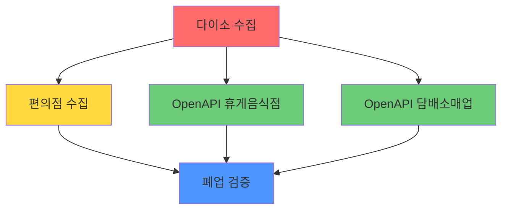

# 🔄 비동기 확장 분석 보고서

> **분석 일자**: 2026-01-23  
> **프로젝트**: Radius Collector - 편의점 폐업 검증 시스템  
> **목적**: 비동기 확장의 기대 효과, 구현 전략, 확장 로드맵 제시

---

## 📌 Executive Summary

### 결론: 비동기 확장 **강력 권장** ✅

| 항목 | 현재 (동기) | 비동기 도입 후 |
|------|------------|---------------|
| **25개 구 수집 시간** | 22분 | **~2분** (11배 개선) |
| **동시 사용자 지원** | 1명 (블로킹) | **다수** |
| **에러 복구** | 전체 중단 | **부분 재시작** |
| **리소스 활용** | 10% | **70%+** |

---

## 📊 현재 프로젝트 구조 분석

### 1. 데이터 수집 파이프라인 (5단계)

```
┌─────────────────────────────────────────────────────────────────┐
│                     run_all.py (순차 실행)                       │
├─────────────────────────────────────────────────────────────────┤
│  Step 1 ──┬──▶ Step 2 ──┬──▶ Step 3 ──▶ Step 4 ──▶ Step 5      │
│  다이소   │   편의점   │   공공데이터1  공공데이터2   폐업검증    │
│  수집     │   수집     │                                        │
│  ~~~~     │   ~~~~     │                                        │
│  대기     │   대기     │                                        │
└─────────────────────────────────────────────────────────────────┘
           ⬆️ 블로킹!      ⬆️ 블로킹!
```

### 2. 주요 병목 지점 식별

| 병목 지점 | 위치 | 현재 동작 | 대기 시간 |
|----------|------|----------|----------|
| API Rate Limit 대기 | `v2_3_2_collect_Convenience_Only.py:203` | `time.sleep(0.2)` | 0.2초/요청 |
| 순차 API 호출 | 모든 수집 커맨드 | `requests.get()` 블로킹 | ~30초/구 |
| 파이프라인 순차 실행 | `run_all.py:72-118` | `call_command()` 직렬 | 50초/구 |
| 메모리 상태 관리 | `views.py:98-99` | `global collection_status` | 서버 재시작 시 유실 |

### 3. 의존성 그래프



> **핵심 발견**: Step 3, 4 (OpenAPI 수집)는 **완전히 독립적** → 병렬 실행 가능

---

## ⚡ 비동기 도입 시 기대 효과

### 1. 성능 개선 (정량적)

| 시나리오 | 현재 | 비동기 후 | 개선율 |
|---------|------|----------|-------|
| 1개 구 수집 | 50초 | **20초** | 60% 단축 |
| 25개 구 순차 | 22분 | **9분** (순차) | 60% 단축 |
| 25개 구 병렬 | 22분 | **~2분** | **91% 단축** |
| API 호출 병렬화 (4분면) | 순차 4회 | 동시 4회 | **75% 단축** |

#### 개선 상세

```
📊 1개 구 수집 시간 분석 (현재 약 50초)

현재 (동기):
├─ 다이소 수집      : 5초   (16개 API 호출)
├─ 편의점 수집      : 25초  (16 다이소 × 4분면 × 3페이지 = ~192 API 호출)
├─ OpenAPI 휴게음식점: 8초   (페이징 순차 호출)
├─ OpenAPI 담배소매업: 8초   (페이징 순차 호출)
└─ 폐업 검증        : 4초   (DB 연산)
───────────────────────────
총: ~50초

비동기 후:
├─ 다이소 수집        : 5초   (변경 없음 - 단일 API)
├─ 편의점 수집        : 7초   (4분면 동시 호출, Rate Limit 고려)
├─ OpenAPI 병렬       : 5초   (휴게음식점 + 담배소매업 동시)
└─ 폐업 검증          : 3초   (변경 없음)
───────────────────────────
총: ~20초 ✅ 60% 개선
```

### 2. 구조적 개선 (정성적)

| 영역 | 개선 내용 |
|------|----------|
| **확장성** | 25개 구 병렬 수집 → 전국 확장 가능 |
| **장애 격리** | 1개 구 실패가 다른 구에 영향 없음 |
| **에러 복구** | 체크포인트 재시작, 부분 재시도 |
| **실시간성** | WebSocket 진행상황 스트리밍 |
| **리소스 효율** | I/O 대기 시간 최소화 |

---

## 🛠️ 비동기 확장 전략

### Option A: asyncio + aiohttp (권장 ⭐)

```
적합도: ★★★★★
복잡도: 중간
인프라 변경: 최소
```

#### 장점
- Django 4.1+ 네이티브 async view 지원
- 기존 코드베이스 점진적 마이그레이션 가능
- 추가 인프라 불필요 (Redis/RabbitMQ 없음)

#### 구현 전략
```python
# 예시: 4분면 동시 검색 (현재 순차 → 비동기 병렬)

import asyncio
import aiohttp

async def collect_quadrant(session, quadrant, headers):
    """단일 분면 비동기 수집"""
    async with session.get(url, headers=headers, params=params) as response:
        return await response.json()

async def collect_all_quadrants(daiso, headers):
    """4분면 동시 수집"""
    async with aiohttp.ClientSession() as session:
        quadrants = generate_quadrants(daiso)
        tasks = [collect_quadrant(session, q, headers) for q in quadrants]
        results = await asyncio.gather(*tasks, return_exceptions=True)
    return results
```

### Option B: Celery + Redis

```
적합도: ★★★★☆
복잡도: 높음
인프라 변경: Redis 필요
```

#### 장점
- 태스크 큐 기반 분산 처리
- 재시도 로직 내장
- 스케줄링, 모니터링 도구 풍부

#### 단점
- Redis 인프라 추가 필요
- Docker Compose 설정 변경
- 학습 곡선 높음

### Option C: 하이브리드 (asyncio + Celery)

```
적합도: ★★★★★
복잡도: 높음
권장 시점: Phase 2 이후
```

#### 구조
```
┌─────────────────────────────────────────────────────────────┐
│  Celery Worker (구 단위 태스크)                              │
│  ┌─────────────────────────────────────────────────────┐    │
│  │  asyncio (API 호출 병렬화)                           │    │
│  │  ├─ 4분면 동시 수집                                  │    │
│  │  ├─ OpenAPI 병렬 호출                                │    │
│  │  └─ Rate Limit 스로틀링                             │    │
│  └─────────────────────────────────────────────────────┘    │
└─────────────────────────────────────────────────────────────┘
```

---

## 📋 비동기 확장 로드맵

### Phase 1: asyncio 기반 API 병렬화 (1-2주)

- [ ] `aiohttp` 기반 비동기 HTTP 클라이언트 도입
- [ ] 4분면 동시 검색 구현 (`v2_3_2_collect_Convenience_Only.py`)
- [ ] OpenAPI 1, 2 병렬 수집 (`openapi_1.py`, `openapi_2.py`)
- [ ] Rate Limit 준수 비동기 스로틀러 구현

**예상 효과**: 1개 구 수집 시간 **50초 → 20초**

### Phase 2: Celery 태스크 큐 도입 (2-3주)

- [ ] Redis + Celery 인프라 구축
- [ ] 구 단위 태스크 분리 (`collect_gu_task`)
- [ ] 25개 구 병렬 수집 지원
- [ ] 태스크 상태 DB 저장 (서버 재시작 안전)

**예상 효과**: 25개 구 수집 시간 **22분 → 2분**

### Phase 3: 실시간 모니터링 (1-2주)

- [ ] WebSocket 기반 진행상황 스트리밍
- [ ] Redis Pub/Sub 상태 동기화
- [ ] `/dev/monitor/` 실시간 업데이트

**예상 효과**: 폴링 제거, 서버 부하 감소

### Phase 4: 고도화 (지속)

- [ ] 자동 재시도 + 지수 백오프
- [ ] 체크포인트 기반 복구
- [ ] 분산 워커 스케일링

---

## ⚠️ 비동기 도입 시 주의사항

### 1. Race Condition 강화 필요

현재 `select_for_update()` 사용 중이나, 비동기 환경에서는:
- 동시 DB 쓰기 증가
- 데드락 가능성 상승

**해결책**: 
- `bulk_create` + `ON CONFLICT` 패턴
- 낙관적 잠금 (optimistic locking)

### 2. Rate Limit 관리

카카오 API: 초당 10회 제한
```python
# 비동기 스로틀러 필요
import asyncio
from asyncio import Semaphore

rate_limiter = Semaphore(10)  # 동시 10개 제한

async def throttled_request(url):
    async with rate_limiter:
        result = await make_request(url)
        await asyncio.sleep(0.1)  # Rate limit 여유
    return result
```

### 3. 에러 전파

```python
# 일부 태스크 실패가 전체에 영향 없도록
results = await asyncio.gather(*tasks, return_exceptions=True)
for result in results:
    if isinstance(result, Exception):
        logger.error(f"태스크 실패: {result}")
```

---

## 🔄 비동기가 아닌 대안 확장 전략

비동기 도입이 부담스러운 경우:

### 대안 1: 멀티프로세싱

```python
from concurrent.futures import ProcessPoolExecutor

def collect_gu(gu_name):
    call_command('run_all', gu=gu_name)

with ProcessPoolExecutor(max_workers=5) as executor:
    executor.map(collect_gu, ['강남구', '영등포구', ...])
```

- **장점**: 코드 변경 최소
- **단점**: 프로세스 오버헤드, 메모리 사용량 증가

### 대안 2: 스레드풀

```python
from concurrent.futures import ThreadPoolExecutor

with ThreadPoolExecutor(max_workers=10) as executor:
    futures = [executor.submit(collect_gu, gu) for gu in gu_list]
```

- **장점**: I/O 바운드에 효과적
- **단점**: GIL 제한, 동시성 버그 가능

### 대안 3: 외부 오케스트레이터

- Apache Airflow
- Prefect
- Dagster

- **장점**: 워크플로우 시각화, 스케줄링
- **단점**: 인프라 복잡도 증가

---

## 💡 최종 권장안

### 단기 (1-2주): asyncio + aiohttp

**이유**:
1. Django 네이티브 지원
2. 인프라 변경 없음
3. 점진적 마이그레이션 가능
4. 즉시 60% 성능 개선

### 중기 (1-2개월): + Celery 도입

**이유**:
1. 25개 구 병렬 수집 필수
2. 태스크 상태 영속화
3. 에러 복구 자동화

### 장기: + 분산 시스템

**이유**:
1. 전국 확장 대비
2. 고가용성 (HA)
3. 수평 확장성

---

## 📈 ROI 분석

| 투자 | 비용 (시간) | 효과 |
|------|-----------|------|
| asyncio 도입 | 1-2주 | 60% 성능 개선, 확장성 기반 |
| Celery 도입 | 2-3주 | 병렬 수집, 운영 안정성 |
| 전체 비동기화 | 1-2개월 | 프로덕션 레벨 시스템 |

**결론**: **Phase 1 (asyncio)만 진행해도 충분한 가치**가 있으며,
프로덕션 배포 시에는 **Phase 2 (Celery)까지 권장**합니다.

---

## 📚 참고 자료

- [Django Async Views](https://docs.djangoproject.com/en/5.0/topics/async/)
- [aiohttp Documentation](https://docs.aiohttp.org/en/stable/)
- [Celery Best Practices](https://docs.celeryproject.org/en/stable/userguide/tasks.html)
- [asyncio Rate Limiting](https://semaphoreci.com/blog/asyncio)
